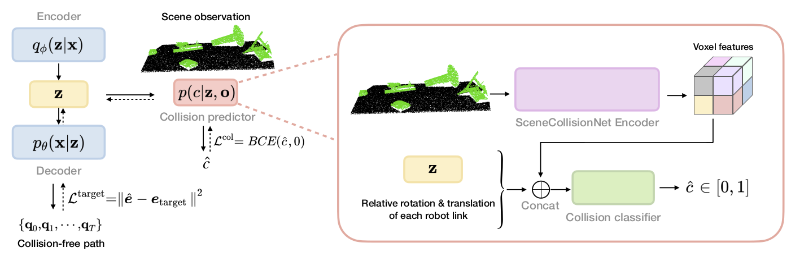

----

## Overview



We introduce a method remarkably extending <a href="https://ieeexplore.ieee.org/document/9718343" target="_blank">Latent Space Path Planning (LSPP)</a> and named it **Activation Maximisation Planning in Latent Space (AMP-LS)**. Similar to LSPP, AMP-LS leverages a variational autoencoder (VAE) to learn a structured latent space to generate kinematically feasible joint trajectories. While a collision predictor in the prior work relies on state-based obstacle representations, our collision predictor leverages scene embeddings obtained from <a href="https://sites.google.com/nvidia.com/scenecollisionnet" target="_blank">SceneCollisionNet</a> to readily achieve zero-shot transfer to unseen environments. Further, we present an approach for explicit collision checking to directly regularise the optimisation to plan collision-free trajectories.

----
## Simulated Experiments

<p>AMP-LS demonstrates a commensurate success rate against several traditional sampling and optimisation-based approaches, but the planning time of AMP-LS is an order of magnitude faster than the baselines.</p><br>
<div class="w3-row-padding">
    <div class="w3-col s3 w3-center">
        <video height="auto" width="100%" controls muted>
          <source src="./video/amp_ls.mp4" type="video/mp4">
        </video>
        <div class="method-name">AMP-LS (Our method)</div>
    </div>
    <div class="w3-col s3 w3-center">
        <video height="auto" width="100%" controls muted>
        <source src="./video/lazyprmstar.mp4" type="video/mp4">
        </video>
        <div class="method-name">Lazy PRM* <br/>(90-degree rotated view)</div>
    </div>
    <div class="w3-col s3 w3-center">
        <video height="auto" width="100%" controls muted>
          <source src="./video/rrtconnect.mp4" type="video/mp4">
        </video>
        <div class="method-name">RRT-Connect</div>
    </div>
    <div class="w3-col s3 w3-center">
        <video height="auto" width="100%" controls muted>
          <source src="./video/chomp.mp4" type="video/mp4">
        </video>
        <div class="method-name">CHOMP <br/>(Failed to find a trajectory)</div>
    </div>
</div>

----
## Real-World Experiments for Open-Loop Planning
<!-- <span class="env-name"><b>Real-World Environments</b></span> -->
<p>We qualitatively evaluate AMP-LS in unseen real-world static scenes. A robot reaches an unassembled table leg while avoiding a yellow table.</p><br>
<div class="w3-row-padding">
    <div class="w3-col s6 w3-center">
        <video height="auto" width="70%" controls autoplay loop muted>
          <source src="./video/open_loop-real_world.mp4" type="video/mp4">
        </video>
        <!-- <div class="method-name">Furniture Avoidance</div> -->
    </div>
    <div class="w3-col s6 w3-center">
        <video height="auto" width="70%" controls autoplay loop muted>
          <source src="./video/open_loop-real_world2.mp4" type="video/mp4">
        </video>
        <!-- <div class="method-name">Conveyor Target Reaching</div> -->
    </div>
</div>

----
## Real-World Experiments for Closed-Loop Planning
<p>As our method is, by design, an efficient local planner, AMP-LS is able to act reactively when operated as a closed-loop system. In this real-world experiment, a robot successfully reaches a moving target while avoiding an obstacle on the conveyor belt by using closed-loop planning.</p><br>
<div class="w3-row-padding">
    <div class="w3-col s12 w3-center">
        <video height="auto" width="70%" controls autoplay loop muted>
          <source src="./video/closed_loop_real-world.mp4" type="video/mp4">
        </video>
        <!-- <div class="method-name">Furniture Avoidance</div> -->
    </div>
</div>

----

## Citation
```
@inproceedings{yamada2023leveraging,
  title={Leveraging scene embeddings for gradient-based motion Planning in latent space},
  author={Yamada, Jun and Hung, Chia-Man and Collins, Jack and Havoutis, Ioannis and Posner, Ingmar},
  booktitle={2023 IEEE International Conference on Robotics and Automation (ICRA)},
  pages={},
  year={2023},
  organization={IEEE}
}
```
